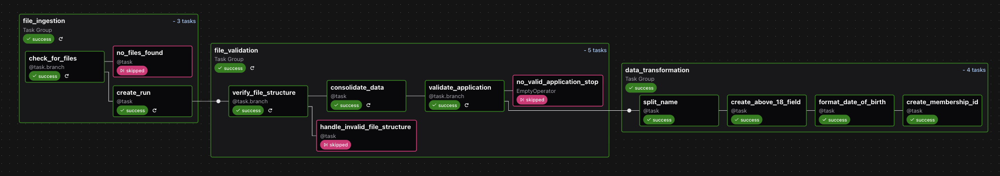

# Section 1: Membership Application Processing Pipeline

## Introduction

This project is a data pipeline designed to process e-commerce membership applications. It automates the ingestion, cleaning, validation, and processing of application data, separating successful and unsuccessful applications into different folders for downstream use. The pipeline is built using Apache Airflow and is containerized with Docker for easy setup and deployment.


## Docker Setup

To get the pipeline running, you'll need Docker installed on your machine.

### Prerequisites
Before you begin, ensure you have the following installed on your system:

- Docker: https://www.docker.com/get-started

- Docker Compose: https://docs.docker.com/compose/install/
### Build the Docker Image

To build the Docker image for this project, navigate to the directory `section_1` of the project (dockerfile and docker-compose.yml should be present) and run the following command:
```bash
docker-compose up --build
```
This command will build the Docker image based on the instructions in the dockerfile and the dependencies listed in requirements.txt. It will also start the Airflow container using Docker Compose.

### Access the Airflow UI
You can access the Airflow web interface by navigating to http://localhost:8080 in your web browser.
- Note on Credentials 
    - The default username and password for the Airflow UI are set up for you. You can find the credentials in the `section_1/airflow/simple_auth_manager_passwords.json`.generated file within the project directory.

### What's mounted
My Compose file mounts the following paths:

- ./airflow → /opt/airflow

    - This contains your Airflow project, including dags/ (e.g., airflow/dags/membership_pipeline.py). Airflow’s home inside the container is /opt/airflow, so your DAGs are visible at /opt/airflow/dags.

- ./data → /opt/data

   - this is the data root used by the pipeline (uploads, runs, invalid, etc.). Inside the container the pipeline should read/write under /opt/data.

## How to Run the Pipeline

### Scheduler
The pipeline is scheduled to run every hour, defined in `airflow/membership_pipeline.py`
```
schedule='@hourly'
```
### Manual Trigger
You can also manually trigger the pipeline at any time. This is useful for testing or for processing data that has been added outside of the normal schedule.

To manually trigger a pipeline run:

1. Access the Airflow UI: Open your web browser and navigate to http://localhost:8080.

2. Find the DAG: On the main dashboard, you will see a list of DAGs (Directed Acyclic Graphs). Locate the membership_pipeline DAG and click on its name to open the details view.

3. Trigger the DAG: In the top-right corner of the screen, you will see a set of icons. Click on the "single run" option to trigger a new run.

4. Monitor the Run: You can monitor the progress of the manually triggered run in the "Graph View" or "Grid View" tabs within the Airflow UI. These views will show you the status of each task in the pipeline as it executes.

## Project Directory Structure
Of course. Here is the directory structure in a copyable markdown format.

```
section_1/
├── airflow/
│   ├── dags/
│   │   ├── membership_pipeline.py
│   │   └── include/
│   │       ├── config.py
│   │       ├── utils.py
│   │       ├── file_ingestion/
│   │       ├── validation/
│   │       ├── data_transformation/
│   │       └── error_handling/
│   └── ...
├── data/
│   ├── runs/
│   │   ├── manual__<timestamp>/
│   │       ├── 0-raw/
│   │       ├── 1-landing
│   │       ├── 2-consolidated
│   │       ├── 3-validated/
│   │       ├── 4-success_application/
│   │       │   └── successful_application.csv
│   │       │   └── successful_application.parquet
│   │       └── rejected_applications/
│   │           └── rejected_applications.log
│   │           └── rejected_applications.parquet
│   ├── uploads/
│   │   ├── applications_dataset_1.csv
│   │   └── applications_dataset_2.csv
│   ├── configuration_folder/
│   │   └── membership_data_configuration_file.json
│   └── invalid/
│       └── manual__<timestamp>/
│               └── {file_name}.log
│               └── {file_name}.csv
├── docker-compose.yml
├── dockerfile
├── README.md
└── successful_application.csv
```

#### Directory and File Descriptions

- **`airflow/dags/`**  
  Contains the Airflow Directed Acyclic Graph (`membership_pipeline.py`) that orchestrates the data pipeline.  
  The `include/` subdirectory houses supporting Python modules, organized into specialized subfolders for configuration, utilities, file ingestion, validation, data transformation, and error handling.
  - **`airflow/dags/include/config.py`**  
  Contains configuration variables for the python modules to use
  - **`airflow/dags/include/utils.py`**  
  Contains utility functions for the python modules to use
  - **`airflow/dags/include/folder_name/`**  
  This directory contains all pipeline logic, organized by responsibility. Each subfolder is a Python package (i.e., contains __init__.py) and exposes an API used by the DAG (membership_pipeline.py). The DAG should only call public functions defined in each package’s __init__.py to keep coupling low.
- **`data/uploads/`**  
  Serves as the initial landing zone for raw application CSV datasets that will be processed by the pipeline.

- **`data/configuration_folder/`**  
  Stores the JSON configuration file (`membership_data_configuration_file.json`) which defines data validation rules and schema expectations.

- **`data/runs/`**  
  Contains execution-specific directories (tagged with `manual__<timestamp>`), representing individual pipeline runs. Each run progresses through multiple stages:
  - **`0-raw/`**: Original input files.  
  - **`1-landing/`**: Pre-processed staging data.  
  - **`2-consolidated/`**: Merged datasets ready for validation.  
  - **`3-validated/`**: Data that has passed validation checks.  
  - **`4-success_application/`**: Final successful application outputs (`.csv` and `.parquet`).   (.csv is for assessor to view)
  - **`rejected_applications/`**: Records that failed validation, logged (`.log`) and stored (`.parquet`).

- **`data/invalid/`**  
  Contains logs and copies of invalid files that could not be ingested or validated, organized by run timestamp.

- **`docker-compose.yml`**  
  Defines and configures Docker services, including the Airflow scheduler, webserver, workers, and any supporting infrastructure.

- **`dockerfile`**  
  Provides build instructions for the Docker image that encapsulates the Airflow environment and its dependencies.

- **`README.md`**  
  Documentation entry point, typically containing project overview, setup instructions, and usage notes.

- **`successful_application.csv`**  
  Processed Dataset for assessor


## Data Pipeline Overview

### Visual representation of Airlow Pipeline 


### The Data Pipeline Process

The pipeline is scheduled to run **every hour** and performs the following tasks:

1.  **File Ingestion**: Checks for new CSV files in the `data/uploads` folder. If new files are found, a new pipeline run is created.

2.  **Data Consolidation**: All CSV files are consolidated into a single Parquet file for more efficient processing.

3.  **Data Validation**: The consolidated data is validated against a set of rules defined in `membership_data_configuration_file.json`. These rules include:
    * **Mobile Number**: Must be 8 digits long.
    * **Age**: Applicant must be over 18 years old as of January 1, 2022.
    * **Email**: Must end with `@emailprovider.com` or `@emailprovider.net`.
    * **Name**: Must not be empty.

4.  **Data Transformation**: For successful applications, the following transformations are applied:
    * The `name` field is split into `first_name` and `last_name`.
    * The `birthday` field is formatted to `YYYYMMDD`.
    * A new field, `above_18`, is created.
    * A unique `membership_id` is generated by combining the user's last name with a truncated SHA256 hash of their birthday.

5.  **Output**:
    * **Successful Applications**: Processed and transformed data is saved in the `data/runs/{pipeline_run_id}/4-successful_applications` folder in both CSV and Parquet formats.
    * **Unsuccessful Applications**: Data that fails validation is moved to the `data/runs/{pipeline_run_id}/unsuccessful_applications` folder.

---

### Data Configuration file

The pipeline's validation logic is highly configurable and driven by the `membership_data_configuration_file.json` file located in the `data/configuration_folder/`. This approach allows you to modify data rules—such as data types, length constraints, and format requirements—without altering any of the pipeline's underlying Python code. 

#### Structure of the Configuration File

The configuration file is a JSON object where each key represents a column name from the input dataset (e.g., "name", "birthday", "mobile_no"). The value for each key is another object containing the specific validation rules for that column.

#### Example
```json
{
  "file_type": ".csv", # Check for File Type
  "column_names": ["name", "email", "date_of_birth", "mobile_no"], 
  "data_validation": { 
    "name": {  # column name
      "data_type": "string", 
      "validate_mandatory": true # Data Contracts
    }
  }
}
```
---

### Error Handling

The pipeline currently handles three main types of errors:

- **Handling Missing Files:** The pipeline first checks if there are any files to process in the uploads folder. If no files are found, it triggers a specific task `no_files_found` that logs this event, preventing the pipeline from running unnecessarily. 
    - These files are located in `data/invalid/{pipeline_run_id}/`

- **Invalid File Structure:** The verify_file_structure task checks if the files have the correct file extension as defined in your configuration file. If a file has an invalid type, it's moved to a separate invalid folder, and a log is created detailing the error.
    - These files are located in `data/invalid/{pipeline_run_id}/`

- **Data Validation and Rejection:** During the validate_application step, each row of the consolidated data is checked against the rules in your JSON configuration. Rows that fail these checks are considered "invalid" and are moved to a rejected_applications folder, again with a corresponding log file. This is another example of a Dead Letter Queue, allowing the pipeline to continue processing valid applications while setting aside the invalid ones.
    * Invalid data is saved in `data/runs/{pipeline_run_id}/rejected_applications/` diirectory instead for further action and can be moved to the `invalid` folder at any time.